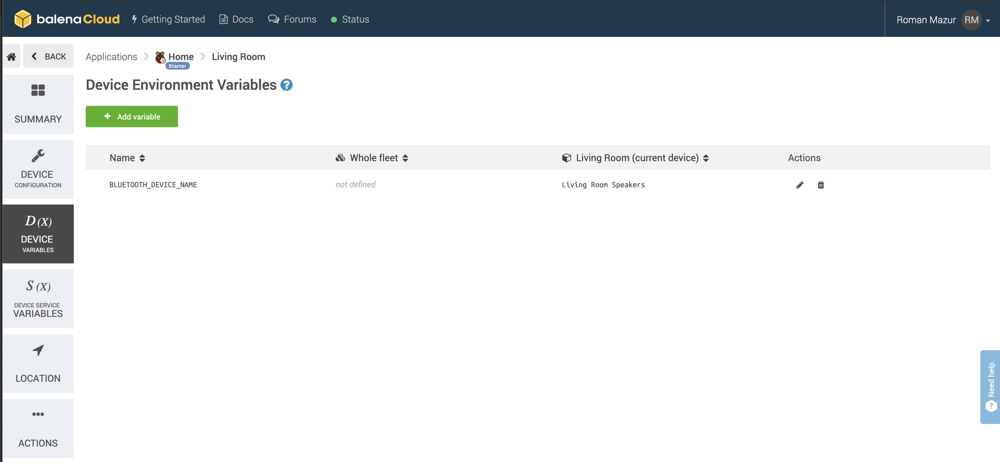

# Bluetooth, Airplay and Spotify audio streaming for any audio device

**Starter project enabling you to add audio streaming via Bluetooth, Airplay or Spotify Connect to any old speakers or Hi-Fi using just a Raspberry Pi.**

This project has been tested on Raspberry Pi 3B/3B+ and Raspberry Pi Zero W. If you're using a Raspberry Pi 3 or above you don't need any additional hardware but if you'd like to use a Pi Zero W this will require an additional HAT as this model has no audio output.

## Hardware required

* Raspberry Pi 3A+/3B/3B+/Zero W
* SD Card (we recommend 8GB Sandisk Extreme Pro)
* Power supply
* 3.5mm audio cable to the input on your speakers/Hi-Fi (usually 3.5mm or RCA)

**Note:** the Raspberry Pi Zero cannot be used on it's own as it has no audio output. To use the Pi Zero you'll need to add something like the [Pimoroni pHAT DAC](https://shop.pimoroni.com/products/phat-dac) to go with it.

## Software required

* A download of this project (of course)
* Software to flash an SD card ([balenaEtcher](https://balena.io/etcher))
* A free [balenaCloud](https://balena.io/cloud) account
* The [balena CLI tools](https://github.com/balena-io/balena-cli/blob/master/INSTALL.md)

## Setup and use

To run this project is as simple as deploying it to a balenaCloud application; no additional configuration is required (unless you're using a DAC HAT).

### Setup the Raspberry Pi

* Sign up for or login to the [balenaCloud dashboard](https://dashboard.balena-cloud.com)
* Create an application, selecting the correct device type for your Raspberry Pi
* Add a device to the application, enabling you to download the OS
* Flash the downloaded OS to your SD card with [balenaEtcher](https://balena.io/etcher)
* Power up the Pi and check it's online in the dashboard

### Deploy this application

* Install the [balena CLI tools](https://github.com/balena-io/balena-cli/blob/master/INSTALL.md)
* Login with `balena login`
* Download this project and from the project directory run `balena push <appName>` where `<appName>` is the name you gave your balenaCloud application in the first step.

### Customize device name

By default, your device will be named `balenaSound xxxx`. This name will show within Airplay device lists, for Spotify Connect and when searching for devices using Bluetooth.
You can change this using `BLUETOOTH_DEVICE_NAME` environment variable that can be set in balena dashboard
(navigate to dashboard -> app -> device -> device variables). This environment variable sets the name for all 3 services.

### Set output volumes

By default, balenaSound will set the output volume of your Raspberry Pi to 100% on the basis you can then control the volume upto the maximum from the connected bluetooth device. If you would like to override this, define the `SYSTEM_OUTPUT_VOLUME` environment variable.

Secondly, balenaSound will play connection/disconnection notification sounds at a volume of 75%. If this unsuitable, you can override this with the `CONNECTION_NOTIFY_VOLUME` environment variable.

**Note:** these variables should be defined as integer values without the `%` symbol.

### Set bluetooth PIN code (optional)

By default, balenaSound bluetooth will connect using Secure Simple Pairing mode. If you would like to override this and use Legacy Mode with a PIN code you can do it by defining the `BLUETOOTH_PIN_CODE` environment variable. The PIN code must be numeric and up to six digits (1 - 999999).

**Note**: Legacy Mode is no longer allowed on [iOS](https://developer.apple.com/accessories/Accessory-Design-Guidelines.pdf) devices.

### Bluetooth Scripts (optional)

balenaSound has configurable scripts you can run on connect and disconnect bluetooth events. If you would like to activate this, set the  `BLUETOOTH_SCRIPTS` environment variable to `true`.
Sample scripts can be found on the `./bluetooth-audio/bluetooh-scripts/` directory, theses can be edited as needed.

### Spotify login (optional)

balenaSound Spotify Connect works with only Spotify Premium accounts (due to the use of the [librespot](https://github.com/librespot-org/librespot) library).
To enable Spotify login you can add your username/e-mail and password, which are set with two environment variables: `SPOTIFY_LOGIN` and `SPOTIFY_PASSWORD`.  **Note:** this is only required if you want to use Spotify Connect via the internet, the login is not required on local networks.

## Connect

* After the application has pushed and the device has downloaded the latest changes you're ready to go!
* Connect the audio output of your Pi to the AUX input on your Hi-Fi or speakers
* The `balenaSound xxxx` name is used by default, where `xxxx` will be the first 4 characters of the device ID in the balenaCloud dashboard.
* If using Bluetooth: search for your device on your phone or laptop and pair.
* If using Airplay: select the balenaSound device from your audio output options.
* If using Spotify Connect: open Spotify and choose the balenaSound device as an alternate output.
* Let the music play!

#balena-homeassistant
##Home Assistant with balenaSense using MQTT

A full step-by-step tutorial is available here: https://www.balena.io/blog/monitor-air-quality-around-your-home-with-home-assistant-and-balena/

Home Assistant is a popular open source home automation system that is often run from low-cost devices like a Raspberry Pi. Here’s how to use balenaSense to push its sensor data to Home Assistant using MQTT.

##Hardware required
Here’s the list of items required for a basic setup:

Raspberry Pi 3B or greater (A B+ or 4B works great, and less powerful Pis can be used albeit with lower performance)
32GB (or larger) Micro-SD Card (we recommend Sandisk Extreme Pro SD cards)
Power supply and cable
Optional: For connecting wireless devices such as locks and light switches, a Z-Wave gateway such as the Aeotec Z-Stick Gen5
Software required
This repository contains all of the software and configuration you’ll need to get started. We’re going to deploy this project on balenaCloud using a free account to push the project and all the software to your Raspberry Pi as well as to provide remote access. Therefore, you’ll need:

A tool to flash your SD card, such as balenaEtcher
A free balenaCloud account
A clone or download of our project from GitHub
Configuring Home Assistant
A text editor called Hass-Configurator is available locally on port 3218. Using this editor, you can make changes to the Home Assistant configuration file /hass-config/configuration.yaml which is the default folder for Hass-Configurator.

You can enable MQTT in Home Assistant from the Configuration > Integrations menu or by adding the folloowing lines to configuration.yaml:

mqtt:  
  broker: mqtt

(note that there must be two spaces before the word broker.) Here we are telling Home Assistant to enable MQTT, and providing the hostname of our local MQTT broker container (you could also provide the IP address of the local container or the IP address of any other reachable broker you might want to use.) Any time you change the configuration, you should go back to Home Assistant and use its configuration checker to make sure your changes do not contain any errors. If there are no errors, restart Home Assistant for your changes to take effect.

##Integrate Home Assistant with balenaSense
You can follow the balenaSense tutorial to create a self-contained air quality monitoring device. Confirm that your balenaSense installation is up and running on the same network as this project.

Add a device variable to your balenaSense device in the balenaCloud dashboard. In the “Add variable” popup, for “NAME” enter TELEGRAF_MQTT_URL_PORT and then paste the IP from your Home Assistant application into the “VALUE” box. Append :1883 after the address which is the port number. After clicking "Add" balenaSense will restart and begin publishing its sensor data to Home Assistant.

Before we can actually see the sensors in Home Assistant, we need to add them to the configuration.yaml file. You can see the sensors we want to add by opening the file /hass-config/sense.yaml in the configuration editor. Copy the full contents of this file and paste into the bottom of the configuration.yaml file.

Alternatively, you can run a script we prepared to do the copying for you. In the Hass-Configurator, click the gear icon in the upper right and select “Execute shell command.” In the popup box, type /hass-config/sensors.sh and click “Execute.” Almost immediately, you should see “Task completed!” at which point you can click “Close.” Remember to restart Home Assistant to see the changes.

To see a pre-formatted Lovelace version of the UI in Home Assistant, activate it by adding the following to configuration.yaml:

lovelace:  
  mode: yaml

This change will cause Home Assistant to utilize the ui-lovelace.yaml file we have included.
